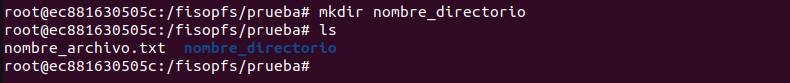

# fisop-fs

Lugar para respuestas en prosa y documentación del TP.

## Estructuras de datos

Para la representación de los archivos y directorios, se optó por una solución simple, que consiste en un array estático de bloques, de tipo `struct block`, que contiene el tipo de archivo (archivo o directorio), si está libre o no, su metadata y su contenido.

```c
typedef struct block {
	int free_status;    // FREE o USED
	file_type_t type;   // ARCH o DIR
	mode_t mode;
	size_t size;
	uid_t user_id;
	gid_t group_id;
	time_t last_accessed_at;
	time_t last_modified_at;
	time_t created_at;
	char path[MAX_PATH];
	char content[MAX_CONTENT];
	char dir_path[MAX_PATH];
} block_t;
```

La estructura del sistema de archivo consiste de un `struct filesystem` que contiene el array de bloques.

```c
struct filesystem {
	struct block blocks[MAX_BLOCKS];
};
```

De este modo, el sistema de archivos consiste únicamente de este array de bloques, inicializados en 0/NULL, excepto por el primero (índice 0), que representa la raíz del sistema.

## Búsqueda por path

Dado un path, se realiza un búsqueda lineal sobre el array de bloques, comparando el path dado con el path registrado en la estructura del bloque.

## Persistencia

Mediante `fwrite`, se guarda en el archivo la variable `filesystem`, que contiene el array de bloques. De este modo, al montar el sistema, se inicializa la variable `filesystem` con aquel guardado en el archivo, y el sistema queda en el estado antes de cerrarse.

## Pruebas:


-Creación de archivos (touch, redirección de escritura):


-Creación de directorios (con mkdir):



-Lectura de directorios, incluyendo los pseudo-directorios . y .. (con ls)

La creación de directorios debe soportar al menos un nivel de recursión, es decir, directorio raíz y sub-directorio.


-Lectura de archivos (con cat, more, less, etc)

cat:


less:


more:


-Escritura de archivos (sobre-escritura y append con redirecciones)


-Acceder a las estadísticas de los archivos (con stat):
Incluir y mantener fecha de último acceso y última modificación
Asumir que todos los archivos son creados por el usuario y grupo actual (ver getuid(2) y getgid(2))


-Borrado de un archivo (con rm o unlink)


-Borrado de un directorio (con rmdir)


